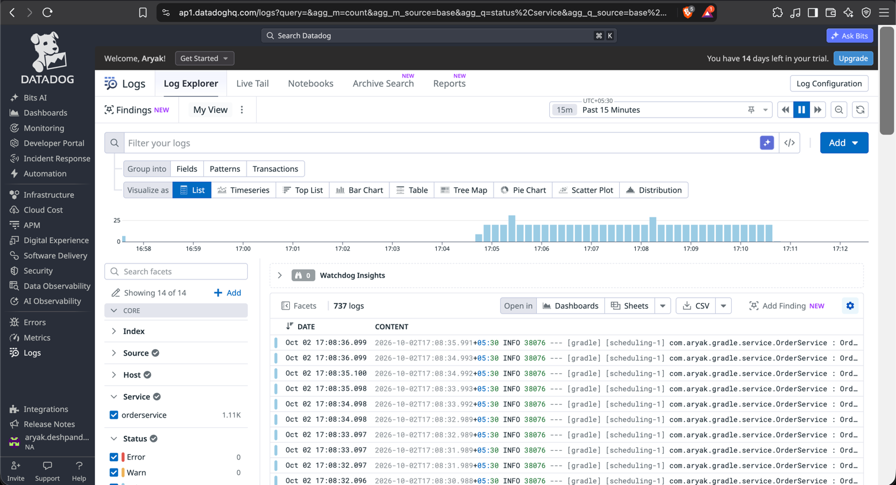

# Test project

A brief description of what this project does and who it's for

## Datadog commands for MacOS

Restart the agent (MacOS)

```bash
sudo launchctl kickstart -k system/com.datadoghq.agent
```

Launch the UI (MacOS)

```bash
sudo datadog-agent launch-gui
```

## Enabling process metrics

It is disabled by default. To enable edit config file: datadog.yaml

```bash
process_config:
  process_collection:
    enabled: true
```

### Installing the docker agent for container metrics:

```
docker run -d --name dd-agent \
-e DD_API_KEY=XXXXXXXXXXXXXXXXXXXXXXXXXXXXXXXX \
-e DD_SITE="ap1.datadoghq.com" \
-e DD_DOGSTATSD_NON_LOCAL_TRAFFIC=true \
-v /var/run/docker.sock:/var/run/docker.sock:ro \
-v /proc/:/host/proc/:ro \
-v /sys/fs/cgroup/:/host/sys/fs/cgroup:ro \
-v /var/lib/docker/containers:/var/lib/docker/containers:ro \
-p 8125:8125/udp \
registry.datadoghq.com/agent:7
```

### Metrics

6 Submission Metric types are supported by Datadog: count, set, rate, histogram, gauge and distribution

Points to note

- DogstatsD or datadog agent automatically aggregates the metrics before sending to backend
- If custom metrics instrumented from app are being sent directly to backend (e.g. no of products sold in last one 1
  minute) then NO aggregation will occur (performance impact)

### Sending custom metrics to datadog

Can be done in 3 ways

- Datadog agent check (python style checks and scripts)
- DogstatsD (app pushes to port 8125 of agent via UDP )
- Native datadog API

### Logging

Need to add logs_agent_enabled: true in datadog.yaml file to enable logging.
And add below content as conf.yaml in /etc/datadog-agent/conf.d/java.d/ directory:

```
#Log section
logs:

    # - type: (mandatory) type of log input source (tcp / udp / file)
    #   port / path: (mandatory) Set port if type is tcp or udp. Set path if type is file
    #   service: (mandatory) name of the service owning the log
    #   source: (mandatory) attribute that defines which integration is sending the log
    #   sourcecategory: (optional) Multiple value attribute. Can be used to refine the source attribute
    #   tags: (optional) add tags to each log collected

  - type: file
    path: /path/to/your/java/log.log
    service: myapplication
    source: java
    sourcecategory: sourcecode
    #For multiline logs, if they start with a timestamp with format yyyy-mm-dd uncomment the below processing rule
    #log_processing_rules:
    #   - type: multi_line
    #     pattern: \d{4}\-(0?[1-9]|1[012])\-(0?[1-9]|[12][0-9]|3[01])
    #     name: new_log_start_with_date
```

